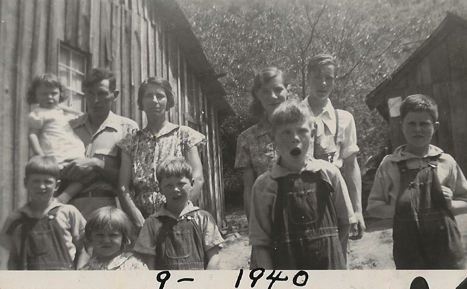

# Lucious Mills

For the Stephens cousins, Lucious Mills was our great-great-uncle. He was a younger brother to John Robert Mills (Granny's father). He was named for his father, and everyone called him (phonetically) "LOOSH" -- with a long U sound. Easy to say, but impossible to spell.

Anyway, Lūsh and his wife Bessie had 6 children before she died. He then married the widow Mamie Ashe, who had 3 children of her own. And before it was popular, they raised a large blended family in a loving home.

One special memory I have of Lūsh and Mamie was them visiting different churches in the county. And they would often sing the old hymn, "On the Winning Side."

* 🎶🎶
I will never have a fear, for my Lord is ever near,
And in him so often I confide;
He's the keeper of my soul since I gave him full control,
And he placed me on the winning side.
🎶🎶 * 

Mamie died in 1987; Lūsh died in 2000 at age 95. They are buried at Fairview Memorial Gardens, in Sylva, Jackson, NC.

Here they are with their children.

